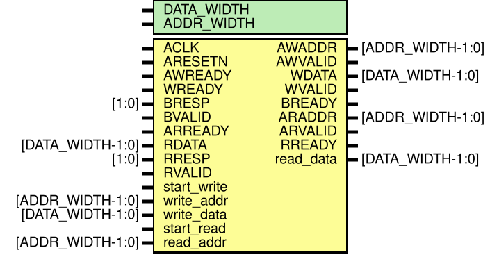
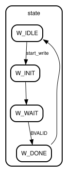
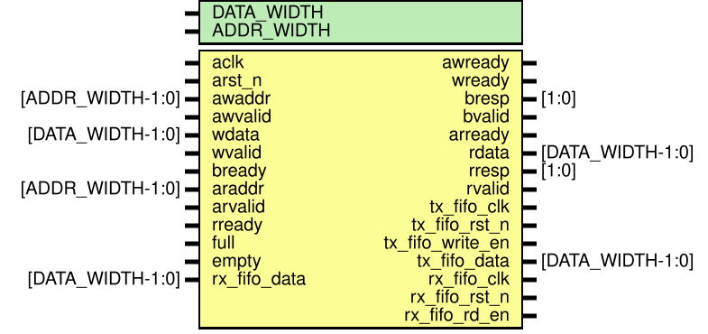

# AXI4 Lite 

# Entity: master 
- **File**: master.v

## Diagram

## Generics

| Generic name | Type | Value | Description |
| ------------ | ---- | ----- | ----------- |
| DATA_WIDTH   |      | 32    |             |
| ADDR_WIDTH   |      | 32    |             |

## Ports

| Port name   | Direction | Type             | Description |
| ----------- | --------- | ---------------- | ----------- |
| ACLK        | input     |                  |             |
| ARESETN     | input     |                  |             |
| AWADDR      | output    | [ADDR_WIDTH-1:0] |             |
| AWVALID     | output    |                  |             |
| AWREADY     | input     |                  |             |
| WDATA       | output    | [DATA_WIDTH-1:0] |             |
| WVALID      | output    |                  |             |
| WREADY      | input     |                  |             |
| BRESP       | input     | [1:0]            |             |
| BVALID      | input     |                  |             |
| BREADY      | output    |                  |             |
| ARADDR      | output    | [ADDR_WIDTH-1:0] |             |
| ARVALID     | output    |                  |             |
| ARREADY     | input     |                  |             |
| RDATA       | input     | [DATA_WIDTH-1:0] |             |
| RRESP       | input     | [1:0]            |             |
| RVALID      | input     |                  |             |
| RREADY      | output    |                  |             |
| start_write | input     |                  |             |
| write_addr  | input     | [ADDR_WIDTH-1:0] |             |
| write_data  | input     | [DATA_WIDTH-1:0] |             |
| start_read  | input     |                  |             |
| read_addr   | input     | [ADDR_WIDTH-1:0] |             |
| read_data   | output    | [DATA_WIDTH-1:0] |             |

## Signals

| Name  | Type      | Description |
| ----- | --------- | ----------- |
| state | reg [1:0] |             |

## Constants

| Name   | Type | Value | Description |
| ------ | ---- | ----- | ----------- |
| W_IDLE |      | 2'b00 |             |
| W_INIT |      | 2'b01 |             |
| W_WAIT |      | 2'b10 |             |
| W_DONE |      | 2'b11 |             |

## Processes
- unnamed: ( @(posedge ACLK or negedge ARESETN) )
  - **Type:** always
- unnamed: ( @(posedge ACLK or negedge ARESETN) )
  - **Type:** always

## State machines

# Entity: slave 
- **File**: slave.v

## Diagram

## Generics

| Generic name | Type | Value | Description |
| ------------ | ---- | ----- | ----------- |
| DATA_WIDTH   |      | 32    |             |
| ADDR_WIDTH   |      | 32    |             |

## Ports

| Port name        | Direction | Type             | Description |
| ---------------- | --------- | ---------------- | ----------- |
| aclk             | input     |                  |             |
| arst_n           | input     |                  |             |
| awaddr           | input     | [ADDR_WIDTH-1:0] |             |
| awvalid          | input     |                  |             |
| awready          | output    |                  |             |
| wdata            | input     | [DATA_WIDTH-1:0] |             |
| wvalid           | input     |                  |             |
| wready           | output    |                  |             |
| bresp            | output    | [1:0]            |             |
| bvalid           | output    |                  |             |
| bready           | input     |                  |             |
| araddr           | input     | [ADDR_WIDTH-1:0] |             |
| arvalid          | input     |                  |             |
| arready          | output    |                  |             |
| rdata            | output    | [DATA_WIDTH-1:0] |             |
| rresp            | output    | [1:0]            |             |
| rvalid           | output    |                  |             |
| rready           | input     |                  |             |
| full             | input     |                  |             |
| tx_fifo_clk      | output    |                  |             |
| tx_fifo_rst_n    | output    |                  |             |
| tx_fifo_write_en | output    |                  |             |
| tx_fifo_data     | output    | [DATA_WIDTH-1:0] |             |
| empty            | input     |                  |             |
| rx_fifo_clk      | output    |                  |             |
| rx_fifo_rst_n    | output    |                  |             |
| rx_fifo_rd_en    | output    |                  |             |
| rx_fifo_data     | input     | [DATA_WIDTH-1:0] |             |

## Signals

| Name        | Type                 | Description |
| ----------- | -------------------- | ----------- |
| ctrl        | reg [DATA_WIDTH-1:0] |             |
| status      | reg [DATA_WIDTH-1:0] |             |
| waddr_latch | reg [ADDR_WIDTH-1:0] |             |
| wdata_latch | reg [DATA_WIDTH-1:0] |             |
| have_waddr  | reg                  |             |
| have_wdata  | reg                  |             |
| raddr_latch | reg [ADDR_WIDTH-1:0] |             |
| have_raddr  | reg                  |             |

## Processes
- unnamed: ( @(*) )
  - **Type:** always
- unnamed: ( @(posedge aclk or negedge arst_n) )
  - **Type:** always
- unnamed: ( @(posedge aclk or negedge arst_n) )
  - **Type:** always
